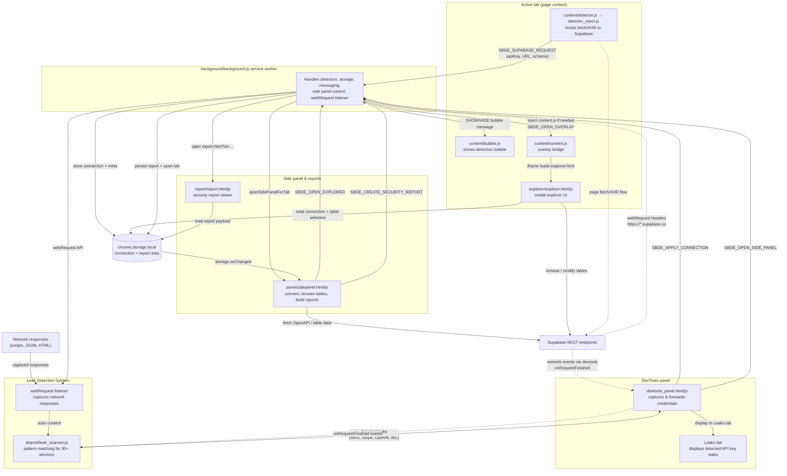

## Supabase Database Explorer Flow

```mermaid
flowchart TD
  subgraph Tab["Active tab (page context)"]
    detector["content/detector.js → detector_inject.js<br/>hooks fetch/XHR to Supabase"]
    bubble["content/bubble.js<br/>shows detection bubble"]
    overlay["content/content.js<br/>overlay bridge"]
    explorer["explorer/explorer.html/js<br/>modal explorer UI"]
  end

  subgraph Background["background/background.js service worker"]
    bg["Handles detection, storage, messaging,<br/>side panel control, webRequest listener"]
  end

  subgraph DevTools["DevTools panel"]
    devtools["devtools_panel.html/js<br/>captures & forwards credentials"]
    leaksTab["Leaks tab<br/>displays detected API key leaks"]
  end

  subgraph LeakDetection["Leak Detection System"]
    scanner["shared/leak_scanner.js<br/>pattern matching for 30+ services"]
    interceptor["webRequest listener<br/>captures network responses"]
  end

  subgraph UI["Side panel & reports"]
    sidepanel["panel/sidepanel.html/js<br/>connect, browse tables, build reports"]
    report["report/report.html/js<br/>security report viewer"]
  end

  storage[(chrome.storage.local<br/>connection + report data)]
  supabase["Supabase REST endpoints"]
  network["Network responses<br/>(scripts, JSON, HTML)"]

  detector -- "SBDE_SUPABASE_REQUEST<br/>(apiKey, URL, schema)" --> bg
  devtools -- "SBDE_APPLY_CONNECTION" --> bg
  devtools -- "SBDE_OPEN_SIDE_PANEL" --> bg
  bg -->|"store connection + meta"| storage
  bg -->|"SHOW/HIDE bubble message"| bubble
  bg -->|"openSidePanelForTab"| sidepanel
  storage -->|"storage.onChanged"| sidepanel
  sidepanel -->|"fetch OpenAPI / table data"| supabase
  sidepanel -->|"SBDE_OPEN_EXPLORER"| bg
  bg -->|"inject content.js if needed<br/>SBDE_OPEN_OVERLAY"| overlay
  overlay -->|"iframe loads explorer.html"| explorer
  explorer -->|"read connection + table selection"| storage
  explorer -->|"browse / modify tables"| supabase
  sidepanel -->|"SBDE_CREATE_SECURITY_REPORT"| bg
  bg -->|"persist report + open tab"| storage
  bg -->|"open report.html?id=…"| report
  report -->|"load report payload"| storage
  supabase -. "webRequest headers<br/>https://*.supabase.co" .-> bg
  supabase -. "network events via devtools<br/>onRequestFinished" .-> devtools
  detector -. "page fetch/XHR flow" .-> supabase
  
  network -- "captured responses" --> interceptor
  interceptor -- "scan content" --> scanner
  scanner -- "detected leaks<br/>(AWS, Stripe, OpenAI, etc.)" --> devtools
  devtools -- "display in Leaks tab" --> leaksTab
  bg -- "webRequest API" --> interceptor
  devtools -. "onRequestFinished events" .-> scanner
```
